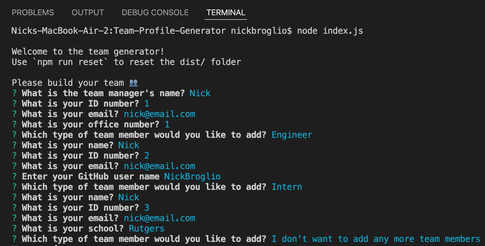
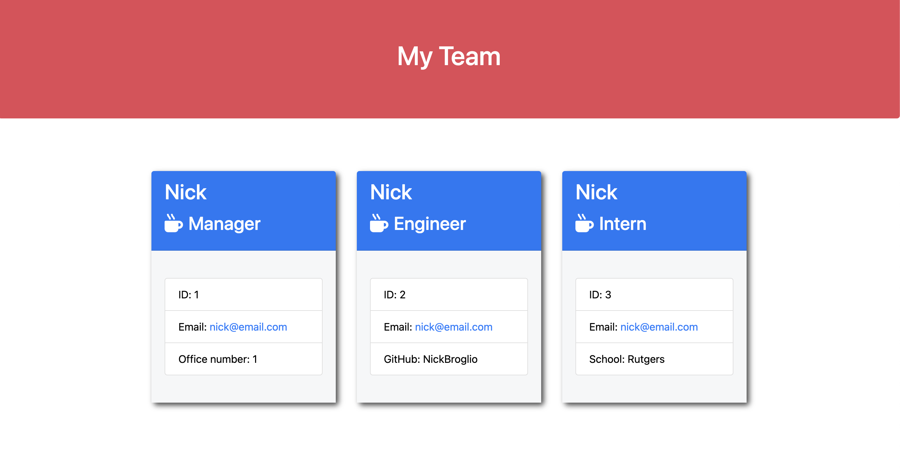

# Team Profile Generator

  

  ## Description
  When the program is run, the prompts ask for the managers information. Then depending on your team, the user can choose to either add more team members or not.
  
  ## Table Of Contents
  * [Installation](#installation)
  * [Usage](#usage)
  
  * [Contributing](#contributing)
  * [Tests](#tests)
  * [Questions](#questions)
  
  ## Installation
  Run the prompts from the command line terminal.
  These are the prompts with the some answers filled in.
  

  ## Usage
  
  
  ## Walkthrough Video Link
  [Video Link](https://www.youtube.com/watch?v=_1BH2VNQ7D4)
  
  
  ## Contributing
  Nick Broglio
  
  ## Tests
  
  
  ## Questions 
  If you have any questions, contact me at:
  
  * Github: NickBroglio
  * Email: nickrbroglio@gmail.com
  
